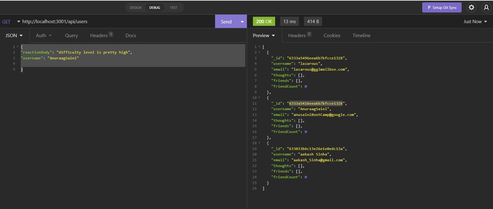

# Social_networking

The project has been developed as a backend for a social networking website, where users can share their thoughts, make friends and their friends can give their reactions on others thought/comments.

# Table of Contents
1. [Description](#Description)
2. [Get_Started](#Get_Started)
3. [Images](#Images)
4. [Application](#Application)
4. [Questions](#Questions)

## Description 
This web-application built as back end provides routes for users to create/delete or update users, their thoughts, friends and friends reaction to thoughts. The application used MongoDB and mongoose for the database support due to its speed with large amounts of data and flexibility with unstructured data. 

## Get Started
you will need to clone repository from https://github.com/Anu-Saini/social_network.git

The project depandencies can be downloaded via npm package manager using ```npm install``` command. the application uses dependecies for express, moment,
mongoose, nodemon, insomnia for testing the routes.

## Images/Assets
The following images will depict the functionality of the APIs in the applicaton

### All Users Page


### Users and Firends


### All thoughts page


### All thoughts with reaction page


## Application  
Since the application is a back end routes for creating database, thus the testing on the routes have been done on localhost through insomnia.
The walk through videos of the creation, deletion , and/or update of users, thought, friends, reaction is available at the below links

### user/ friends walk thru - 
https://drive.google.com/file/d/1za0DppI1wwbDomJSUo88p7b3CT_zlbkq/view

### thoughts and reactions walk thru 
https://drive.google.com/file/d/1xmm-djEmKMfIcXDDSAysedCAxLDR7vfk/view

## Question / inquireies / suggestions 
For questions can be directed to us at the below addresses:
github Username: Anu-Saini
email: anuraagsaini@yahoo.co.in
